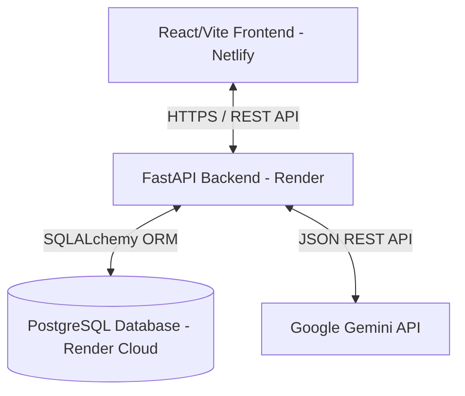

# Aegis Debt AI: Project Architecture & Technical Documentation

Aegis Debt AI is an AI-powered financial recovery and debt negotiation platform designed to help users model, analyze, and negotiate their debt burden. The system combines modern financial analytics with Generative AI (Google Gemini) to predict debt settlement probabilities and generate personalized hardship letters.

This document provides a comprehensive, layout-by-layout, and technical breakdown of the system for engineering leadership and project stakeholders.

---

## 1. System Architecture

Aegis Debt AI uses a decoupled, client-server model architecture built to scale securely in the cloud:



### Components Breakdown:
* **Presentation Layer (Frontend)**: React Single Page Application (SPA) built with Vite, styled using a high-fidelity dark-mode interface with custom glassmorphism and HSL-based palettes. Hosted on **Netlify**.
* **Business Logic Layer (Backend)**: FastAPI Python REST API. Handles authentication, database queries, and score calculations. Hosted on **Render**.
* **Data Layer**: PostgreSQL database in production, SQLite fallback in development. Handled through SQLAlchemy ORM.
* **AI Engine**: Google Gemini API integration, used to generate context-aware negotiation playbooks and legal-grade financial letters.

---

## 2. Frontend Layout & Presentation Specs

The user interface implements a premium, responsive dark-theme design. Glassmorphism cards (`glass-card`) are styled with semi-transparent backdrops, subtle emerald borders, and layout glows.

### 2.1 Authentication Layouts
* **Sign In (`/login`)**:
  - Requires email and password.
  - Generates a JWT access token upon confirmation and stores it locally (`localStorage`).
* **Create Account (`/register`)**:
  - Fields: Email, Password, Monthly Net Income, and Preferred Currency.
  - **Dynamic Input decoration**: When the user changes the currency selection dropdown, the currency prefix icon inside the **Monthly Net Income** input automatically changes (`$`, `₹`, `€`, `£`, `C$`) to match.
  - On submission, user is automatically logged in and redirected to the Dashboard.

### 2.2 Dashboard Layout (`/`)
An analytical command center showing debt metrics:
* **Metric Cards**:
  1. **Total Outstanding Debt**: Cumulative total of all debts formatted in the user's registered currency.
  2. **Monthly Pay Burden**: Total minimum monthly payments.
  3. **Debt-to-Income (DTI) Ratio**: Calculated in real-time (`Total Monthly Payments / Monthly Income`).
  4. **Financial Health Score**: An interactive radial gauge indicating overall financial security (0 to 100).
* **Loan Inventory Tracker**:
  - Displays a tabular listing of all active liabilities showing Creditor Name, Balance, Interest Rate, and Status ("Current", "30 Days Late", "90+ Days Late").
  - Add Asset / Edit Asset Modal: Pop-up overlay with form validation to add or update active loans.
* **Premium Currency Switcher**:
  - Interactive top bar controls (`USD`, `EUR`, `GBP`, `CAD`, `INR`) allowing on-the-fly currency switching. Updating currency here automatically triggers a profile update request to persist the user's preference on the server.

### 2.3 AI Settlement Predictor (`/predictor`)
* Selects any loan from the user's list and computes settlement metrics.
* Displays:
  - **Target Settlement Percentage**: Expected percentage the creditor will agree to (e.g. 45% of total balance).
  - **Estimated Savings**: Direct currency savings from settlement.
  - **Success Likelihood**: Colored badge indicating probability (High, Medium, Low).
  - **Negotiation Strategy**: Dynamic playbook showing step-by-step instructions.

### 2.4 Hardship Letter Generator (`/letters`)
* Form inputs: Creditor Name, Total Balance, Hardship Reason (e.g., Medical Bills, Job Loss), and Proposed Settlement Offer.
* Returns a formatted hardship letter created by Gemini, ready to copy and send to creditors.

---

## 3. Backend Implementation & Business Logic

The backend is built with FastAPI. It enforces strict type-safety via Pydantic and isolates database sessions using dependency injection.

### 3.1 Data Schemas (`models.py` & `schemas.py`)
```sql
CREATE TABLE users (
    id SERIAL PRIMARY KEY,
    email VARCHAR UNIQUE NOT NULL,
    hashed_password VARCHAR NOT NULL,
    monthly_income FLOAT DEFAULT 0.0,
    currency VARCHAR DEFAULT 'USD'
);

CREATE TABLE loans (
    id SERIAL PRIMARY KEY,
    user_id INT REFERENCES users(id) ON DELETE CASCADE,
    creditor_name VARCHAR NOT NULL,
    total_balance FLOAT NOT NULL,
    minimum_payment FLOAT NOT NULL,
    interest_rate FLOAT NOT NULL,
    status VARCHAR DEFAULT 'Current'
);
```

### 3.2 Financial Health Algorithm (`routes.py`)
The system calculates a user's Financial Health Score (out of 100) dynamically using three penalty metrics:
1. **DTI Penalty (Max 40 points)**:
   - DTI ≤ 20%: 0 penalty points.
   - 20% < DTI ≤ 50%: Linear penalty up to 30 points.
   - DTI > 50%: Caps at 40 points.
2. **Delinquency Penalty (Max 40 points)**:
   - Every "30 Days Late" loan: 15 points penalty.
   - Every "90+ Days Late" loan: 30 points penalty.
3. **Interest Penalty (Max 20 points)**:
   - Average interest rates above 8% receive a 1 point penalty per 1% increase, capping at 20 points.

$$\text{Financial Health Score} = \max(100 - (\text{DTI Penalty} + \text{Delinquency Penalty} + \text{Interest Penalty}), 0)$$

### 3.3 Security & Middleware Setup
* **JWT Authentication**: Hashes passwords using `bcrypt` and secures routes via bearer token authentication.
* **CORS Settings**: Restricts access to authorized domains (development localhost and production Netlify domains).
* **Private Network Access (PNA) Middleware**: Includes custom preflight interceptors that inject the `Access-Control-Allow-Private-Network: true` header. This prevents Chromium browsers from blocking connection requests from the public Netlify HTTPS site to the local loopback backend.

---

## 4. Cloud Deployment & DevOps Details

### 4.1 Frontend Deployment (Netlify)
* **Build Command**: `npm run build`
* **Publish Directory**: `dist`
* **SPA Rewrite Configuration (`netlify.toml`)**:
  Redirects all wildcard sub-routes to `index.html` to allow React Router to handle client-side routing:
  ```toml
  [[redirects]]
    from = "/*"
    to = "/index.html"
    status = 200
  ```

### 4.2 Backend Deployment (Render)
* **Service Blueprint (`render.yaml`)**:
  Configured as a unified Blueprint containing a Python Web Service and PostgreSQL database:
  ```yaml
  services:
    - type: web
      name: aegis-debt-ai-backend
      runtime: python
      rootDir: backend
      buildCommand: pip install -r requirements.txt
      startCommand: uvicorn main:app --host 0.0.0.0 --port $PORT
      envVars:
        - key: PYTHON_VERSION
          value: "3.11.9"
        - key: JWT_SECRET
          generateValue: true
        - key: ALGORITHM
          value: HS256
        - key: ACCESS_TOKEN_EXPIRE_MINUTES
          value: "1440"
        - key: GEMINI_API_KEY
          sync: false
        - key: DATABASE_URL
          fromDatabase:
            name: aegis-debt-db
            property: connectionString
  ```
* **Python Runtime Matching (`.python-version`)**:
  Pins Python to version `3.11.9` to ensure Render pulls down pre-compiled wheels for core packages, preventing system compiler dependency conflicts.
